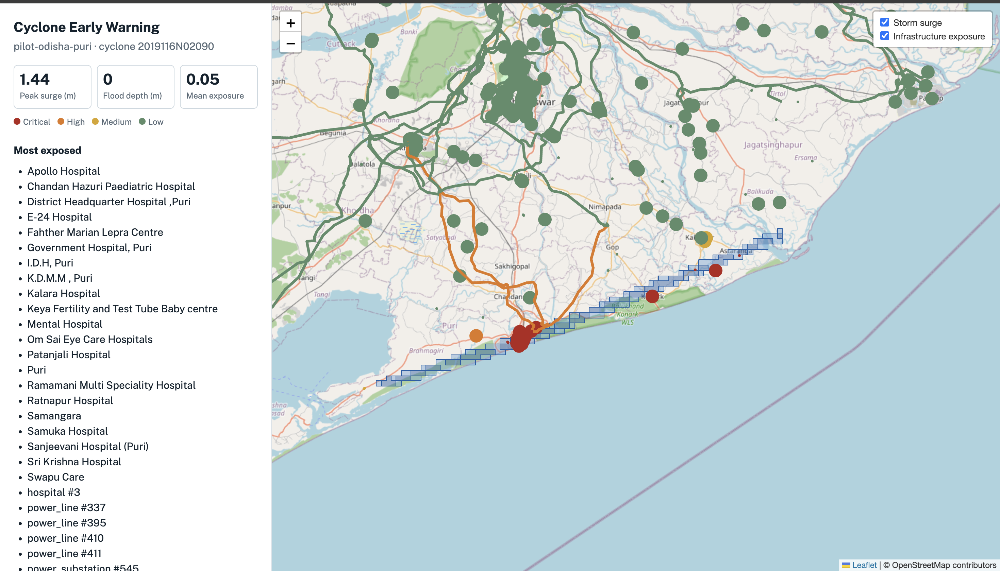

# Cyclone Early Warning Platform

AI-powered predictive risk platform for the Bay of Bengal / coastal APAC region.
Combines historical cyclone track data, a calibrated storm-surge model, and
LLM-generated advisories to help shift disaster response from post-landfall
recovery to pre-landfall evacuation planning.

Pilot region: **Odisha Coast (Puri–Paradip)**, backtested against Cyclone
Fani (2019) and Cyclone Amphan (2020).

## What this actually does right now

- Reads a real cyclone's track (wind speed, pressure, storm size, forward
  speed) from NOAA's IBTrACS database
- Runs a calibrated empirical storm-surge model to estimate surge height and
  inundation extent along the coast
- Runs a simplified rainfall-runoff flood model
- Scores nearby infrastructure (hospitals, shelters, power lines, roads) by
  hazard exposure, weighted by criticality
- Generates a structured, multilingual advisory via Gemini (English, Hindi,
  Bengali, Odia), with a clearly-marked fallback if the LLM call fails
- Serves everything through a FastAPI backend and a Next.js map dashboard

## Screenshot



_Real data: Cyclone Fani's actual 71-point IBTrACS track, calibrated surge
model output (1.44m peak surge), and real OSM-extracted infrastructure
(hospitals, power lines, substations). Road segments are excluded from
scoring/display by default — see "known limitations" below._

## Architecture

```
┌──────────────────┐      ┌───────────────────────┐      ┌───────────────────┐
│  data_pipeline/  │ ───▶ │      PostGIS DB       │ ◀─── │   app/modeling/   │
│  (ingestion)     │      │   (docker-compose)    │      │  (surge/flood/    │
│  IBTrACS, OSM,   │      │                       │      │   exposure calc)  │
│  GEE, met feeds  │      └────────────┬──────────┘      └──────────┬────────┘
└──────────────────┘                   │                            │
                                       ▼                            ▼
                                ┌────────────────────────────────────────────┐
                                │             app/ (FastAPI)                 │
                                │  /regions/*, /advisory/*, /alerts/*        │
                                │  Gemini integration + mock fallback        │
                                └─────────────────────┬──────────────────────┘
                                                      │
                                                      ▼
                                            ┌───────────────────────┐
                                            │    web/ (Next.js)     │
                                            │Map + stats + advisory │
                                            │  dashboard            │
                                            └───────────────────────┘
```

## Repo structure

```
cyclone-platform/
├── app/                  FastAPI backend
│   ├── modeling/         Storm surge, flood, and exposure models
│   ├── routers/          hazards.py, advisory.py, alerts.py
│   ├── services/         Gemini integration
│   ├── schemas/          Pydantic response models
│   └── mock_data/        Static fallback data (used if DB is unreachable)
├── data_pipeline/        Ingestion scripts (IBTrACS, OSM, GEE, met feeds)
│   ├── db/schema.sql     PostGIS schema
│   └── dev_tools/        Local test seed script (bypasses real APIs)
├── web/                  Next.js dashboard
├── docker-compose.yml    Spins up Postgres/PostGIS
├── requirements.txt      Python deps (backend + pipeline, merged)
└── .env.example          All required environment variables
```

## Setup

```bash
# 1. Database
docker compose up -d

# 2. Backend
python3 -m venv venv
source venv/bin/activate          # Windows: venv\Scripts\activate
pip install -r requirements.txt
cp .env.example .env              # fill in GEMINI_API_KEY, see note below
uvicorn app.main:app --reload --port 8000

# 3. Load real cyclone data
cd data_pipeline
python3 -m src.ibtracs_ingest --season 2019 --name FANI
python3 -m src.osm_extraction
cd ..

# 4. Frontend (separate terminal)
cd web
npm install
npm run dev
```

Open **http://localhost:3000** for the dashboard, or **http://localhost:8000/docs**
for the raw API (Swagger UI).

**Don't want to set up Postgres or Gemini right now?** The API still runs
fine without either — it automatically falls back to mock data / a
clearly-marked fallback advisory instead of crashing. Good enough to build
the frontend against.

## What's real data vs. placeholder right now

Being upfront about this matters more than pretending it's all production-grade:

| Component | Status |
|---|---|
| Cyclone track (Fani, 2019) | Real — 71 points from NOAA IBTrACS |
| Storm surge model | Real calculation, backtested against Fani + Amphan |
| Infrastructure (hospitals, power lines, substations) | Real — extracted from OpenStreetMap via Overpass API (574 features scored; road segments excluded by default, see note below) |
| Coastline | Placeholder — simplified 4-point line following the real shore direction; needs a properly digitized coastline for production accuracy |
| Elevation | Placeholder — synthetic distance-from-coast model; swap in real SRTM via `gee_pipeline.py` once GEE access is set up |
| Rainfall (flood model input) | Placeholder — hardcoded value; wire up `met_feeds.py` (Open-Meteo) for real data |
| Gemini advisories | Blocked — see note below |

## Known limitation: Gemini API

As of this writing, Google's new `AQ.`-format API keys have a platform-side
bug where `generateContent` returns 404/401 even for models confirmed
available via `ListModels`, reproduced across multiple developers on
Google's own forum. Not fixable from this codebase. The advisory endpoint
degrades gracefully to a clearly-marked fallback (`is_fallback: true`)
instead of failing — worth mentioning as a resilience feature, not hiding
as a bug.

## Modeling limitations (be upfront about these in any pitch)

- Storm surge is a calibrated empirical formula, not full hydrodynamic
  modeling (SLOSH/ADCIRC-grade) — appropriate for a screening tool, not
  operational forecasting
- Flood model is a simplified "bathtub" model with no real drainage/flow-
  accumulation network
- Delta-funneling geometry (e.g. Sundarbans channels) isn't captured; the
  Amphan backtest needed a region-specific shelf-slope constant, which is a
  real modeling gap, not just a tuning knob
- Backtested against 2 historical events only (Fani, Amphan)
- Real OSM extraction over the full pilot bbox returns ~5,900 infrastructure
  features, ~5,300 of them road segments. These are excluded from exposure
  scoring and the map response by default (`DEFAULT_EXCLUDED_CATEGORIES` in
  `app/modeling/export.py`) — they aren't the critical infrastructure this
  exercise scores, and scoring/rendering all of them was slow enough to
  crash the connection in testing. A production version would need spatial
  indexing and map tiling/clustering to handle full road networks.

## Backtest

```bash
PYTHONPATH=. python3 -m app.modeling.backtest --source hardcoded
```
Both `FANI_2019` and `AMPHAN_2020` should print `OK (within range)`.

## API endpoints

| Endpoint | Purpose |
|---|---|
| `GET /regions/{region_id}/hazard-layers` | Surge/flood/exposure as GeoJSON |
| `GET /regions/{region_id}/summary` | Same data as plain numbers |
| `POST /advisory/generate` | LLM-generated advisory (multilingual) |
| `POST /alerts/dispatch` | Mock alert dispatch (SMS/email/webhook) |

Pilot region ID: `pilot-odisha-puri`

## Team

- Data pipeline (ingestion): _Person 1_
- Hazard modeling (surge/flood/exposure): _Person 2_
- Backend + LLM integration: _Person 3_
- Frontend dashboard: _Person 4_

## License

_Add a license before making this repo public, if you haven't already._


